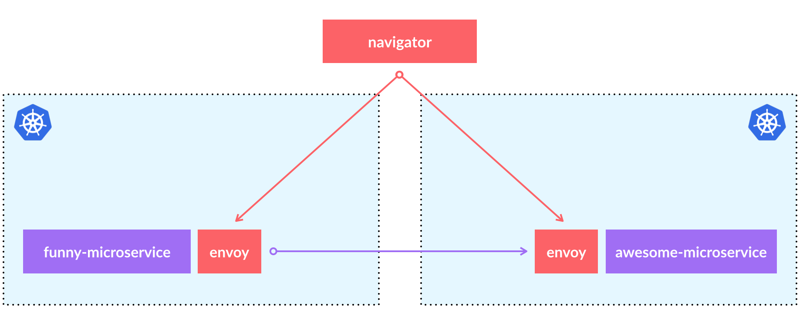

# Navigator

Multicluster Service mesh solution based on envoy with canary deployments support.



Navigator solves following problems:

1. Transparent service discovery through multiple isolated kubernetes clusters.
2. Canary weighted balancing on different versions of microservices.


## Navigator control plane

|  switch             |                                    description                                     |
| ------------------- | ---------------------------------------------------------------------------------- |
| address             | navigator serving address (defaults to 0.0.0.0)                                    |
| port                | navigator GRPC port (defaults to 8001)                                             |
| http-port           | navigator health check and prometheus http endpoint port (defaults to 8089)        |
| log-level           | navigator log level. Allowed values: trace, debug, warn, fatal (defaults to fatal) |
| log-json            | use json formatter for navigator logs                                              |
| profiling           | enable pprof endpoints                                                             |
| sidecar-health      | enable custon health check endpoint configuration for sidecar                      |
| sidecar-health-path | sidecar health check path                                                          |
| sidecar-health-port | sidecar health check port                                                          |


|          env var          |                decription                 |
| ------------------------- | ----------------------------------------- |
| NAVIGATOR_DYNAMIC_CLUSTER | envoy GRPC api config source cluster name |

## Navigator sidecar (built with envoy)

|      env var      |                    decription                     |
| ----------------- | ------------------------------------------------- |
| NAVIGATOR_ADDRESS | navigator host                                    |
| NAVIGATOR_PORT    | navigator port                                    |
| SERVICE_NAME      | service name to which envoy is injected           |
| CLUSTER_NAME      | cluster name (as it configured in navigator)      |
| LOG_LEVEL         | envoy log level (trace, debug, info, warn, fatal) |

## Run tests

kubectl 1.15 is required

Prepare env for tests (kube kind is used):

```
make prepare-for-e2e
```

Run tests:
```
make test-e2e
make test-unit
```
